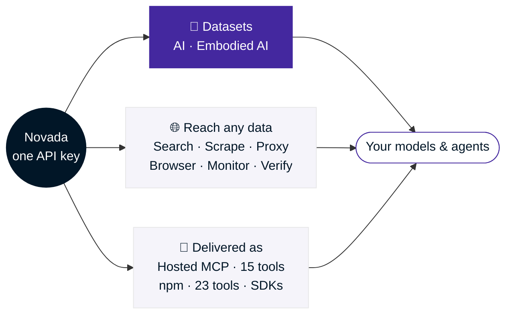
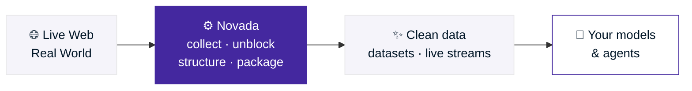

<!-- agent-metadata
name: NovadaLabs
description: The data layer for AI and embodied AI — datasets, plus web-data and proxy infrastructure for customers and AI agents
primary-package: novada-mcp
hosted-endpoint: https://mcp.novada.com/YOUR_KEY/mcp
install: npx -y novada-mcp
env-required: NOVADA_API_KEY
npm-tools: 23
hosted-tools: 15
tools: novada_search, novada_extract, novada_crawl, novada_research, novada_map, novada_site_copy, novada_search_feedback, novada_scrape, novada_ai_monitor, novada_monitor, novada_verify, novada_proxy, novada_browser, novada_browser_flow, novada_account, novada_proxy_account_create, novada_proxy_account_list, novada_ip_whitelist, novada_capture_apikey, novada_static_ip_mgmt, novada_discover, novada_setup, novada_session_stats
integrations: Claude Desktop, Claude Code, Cursor, OpenAI Agents SDK, LangChain, LlamaIndex, CrewAI, n8n, Windsurf, Cline, Codex CLI
categories: ai-training-data, embodied-ai-data, web-data-platform, proxy-network, mcp-server, web-scraping, search, browser-automation
-->

<div align="center">
  <picture>
    <source media="(prefers-color-scheme: dark)" srcset="https://raw.githubusercontent.com/NovadaLabs/.github/main/profile/logo-dark.png">
    
  </picture>

  <h3>The data layer for AI — and the AI that acts in the real world</h3>
  <p>Datasets for training. Search, scrape, proxy, and browser infrastructure for reaching any live data.<br>
  One platform, one API key — powered by our own network across 195 countries.</p>

  <a href="https://www.novada.com"></a>
  <a href="https://developer.novada.com"></a>
  <a href="https://dashboard.novada.com"></a>

  <br><br>

  
  
  
  

  <br><br>

  <a href="https://www.npmjs.com/package/novada-mcp"></a>
  <a href="https://www.npmjs.com/package/novada-mcp"></a>
  <a href="https://github.com/NovadaLabs/novada-mcp/blob/main/LICENSE"></a>
  <a href="https://x.com/Novada_Proxy"></a>
</div>

<br>

## Everything Novada, at a glance



<br>

## Trusted at scale

<div align="center">
  
  
  
  

  <sub>Trusted by <b>8,000+ companies</b> worldwide — we own the network, no reseller markup.</sub>
</div>

<br>

## The infrastructure to reach any data

<table>
<tr>
<td align="center" width="33%">
<br><br>
<b>Search & SERP</b><br>
<sub>5-engine web search · SERP analytics · deep research · live fact-checking</sub>
</td>
<td align="center" width="33%">
<br><br>
<b>Scraping & Extraction</b><br>
<sub>129 structured platforms · any URL → JSON/markdown · async pipeline</sub>
</td>
<td align="center" width="33%">
<br><br>
<b>Proxy Network</b><br>
<sub>100M+ IPs · 6 types · 195+ countries · we own the network</sub>
</td>
</tr>
<tr>
<td align="center" width="33%">
<br><br>
<b>Browser & Unblock</b><br>
<sub>CDP cloud browser · anti-bot bypass · JS rendering · session automation</sub>
</td>
<td align="center" width="33%">
<br><br>
<b>Monitor & Verify</b><br>
<sub>Page change detection · claim fact-checking · diff alerts</sub>
</td>
<td align="center" width="33%">
<br><br>
<b>AI Brand Monitor</b><br>
<sub>ChatGPT · Perplexity · Claude · Gemini · Grok — mentions & sentiment</sub>
</td>
</tr>
</table>

<div align="center"><sub>One API key. One output format. One vendor for the whole web-data surface.</sub></div>

### Global coverage

<div align="center">
  <picture>
    <source media="(prefers-color-scheme: dark)" srcset="https://raw.githubusercontent.com/NovadaLabs/.github/main/profile/coverage-map.png">
    
  </picture>

  <b>100M+ residential IPs across 195+ countries</b> — city-level targeting, on every continent.
</div>

<br>

## Data for AI & Embodied AI

Text taught models to talk. The next generation needs the **video, real-world, and web-scale data** it takes to *act*. Novada maintains a large, continuously-refreshed catalog of training-ready datasets — and sources custom ones on request.

<table>
<tr>
<td width="50%" valign="top">

### 🧠 Data for AI

Curated, ready-to-train **datasets** for LLMs and multimodal models.

- **AI Training Datasets** — structured, deduplicated, training-ready.
- **Web-scale corpora** — real-time and historical, refreshed by live pipelines.
- **Custom dataset requests** — name the domain; we source and structure it.

</td>
<td width="50%" valign="top">

### 🤖 Data for Embodied AI

Grounded, real-world **datasets** for perception and world models.

- **Video Data API** — large-scale video across major platforms · 95% success rate · real-time metadata & comment threads.
- **Multimodal & real-world data** — visual, temporal, and interaction context beyond text.
- **Custom sourcing** — tell us the environment or task; we source and structure the data.

</td>
</tr>
</table>

<div align="center">
<sub><b>What your models can learn from</b></sub>

| 📝 Text | 🖼️ Images | 🎬 Video | 🤲 Real-world interaction | 📍 Geo / location | 🛒 Commerce |
| :---: | :---: | :---: | :---: | :---: | :---: |

<sub>Most vendors sell you a proxy. Novada is the data layer that trains the AI — the proxy is included, not the headline.</sub>
</div>

<br>

## How it works



<sub>One call in → routed across datasets, proxies, browsers, and scrapers → clean data or reliable access lands in your pipeline, ready to train or act on.</sub>

<br>

## Quick Start

Get your key at [novada.com](https://www.novada.com) — free tier, no credit card.

**Option A — Hosted MCP (zero install, 15 tools):**

```json
{
  "mcpServers": {
    "novada": { "url": "https://mcp.novada.com/mcp?token=your_key" }
  }
}
```

```bash
# Claude Code
claude mcp add --transport http novada "https://mcp.novada.com/mcp?token=your_key"

# Or keep your key out of the URL with a Bearer header:
claude mcp add --transport http novada https://mcp.novada.com/mcp --header "Authorization: Bearer your_key"
```

<sub>Path style <code>https://mcp.novada.com/&lt;your_key&gt;/mcp</code> also works.</sub>

**Option B — Local npm (all 23 tools, including browser automation):**

```bash
# Claude Code
claude mcp add novada -e NOVADA_API_KEY=your_key -- npx -y novada-mcp
```

```json
{
  "mcpServers": {
    "novada": {
      "command": "npx",
      "args": ["-y", "novada-mcp"],
      "env": { "NOVADA_API_KEY": "your_key" }
    }
  }
}
```

<details>
<summary><b>All 23 MCP tools</b> — click to expand</summary>

<br>

| Tool | What it does |
| --- | --- |
| **Content retrieval** | |
| `novada_search` | 5-engine web search (Google/Bing/DuckDuckGo/Yandex) with geo-targeting and optional inline extraction. |
| `novada_extract` | Any URL (up to 10) → clean content, links, and structured fields. Auto static/render/browser escalation. |
| `novada_crawl` | BFS/DFS site walk with configurable depth — extract content from each page. |
| `novada_research` | Multi-step research: 3–10 parallel queries → dedup → extract → synthesized report. |
| `novada_map` | Discover a site's full URL structure without reading content. |
| `novada_site_copy` | Copy an entire docs site to disk as one markdown file per page. |
| `novada_search_feedback` | Record search-result quality to bias future ranking. |
| **Scraping & verification** | |
| `novada_scrape` | 16 structured platforms, ~88 operations (Amazon, TikTok, LinkedIn…) → structured records. |
| `novada_ai_monitor` | How ChatGPT, Perplexity, Grok, Claude, Gemini mention a brand — mentions, sentiment, positioning. |
| `novada_monitor` | Page change detection between calls. |
| `novada_verify` | Fact-check a claim via 3 parallel search angles. Returns verdict + confidence. |
| **Proxy** | |
| `novada_proxy` | Proxy credentials for your own HTTP clients — 6 types: residential, ISP, datacenter, mobile, static, dedicated. |
| **Browser** _(local npm only)_ | |
| `novada_browser` | Session-persistent CDP cloud browser — navigate, click, type, screenshot, evaluate. |
| `novada_browser_flow` | Multi-step browser automation via an action-sequence API. |
| **Account & billing** | |
| `novada_account` | Unified dashboard — wallet balance, plan quotas, usage. |
| `novada_proxy_account_create` | Create a proxy sub-account (write, confirm-gated). |
| `novada_proxy_account_list` | List proxy sub-accounts for a product. |
| `novada_ip_whitelist` | Manage the proxy IP whitelist (add/list/remove). |
| `novada_capture_apikey` | Get or reset the Capture API key. |
| `novada_static_ip_mgmt` | Manage static ISP IPs — open, renew, export, list. |
| **Health & discovery** | |
| `novada_discover` | List all available Novada tools with descriptions and categories. |
| `novada_setup` | First-run concierge — validates your API key and orients you. |
| `novada_session_stats` | Per-session usage telemetry — call counts and uptime. |

Full reference at **[developer.novada.com](https://developer.novada.com)**.

</details>

<br>

## Built for production

- **We own the network.** 100M+ residential IPs across 195 countries — no reseller markup, no third-party SLAs.
- **Datasets, not just access.** A large, continuously-refreshed catalog for AI and embodied-AI training — plus custom sourcing on request.
- **One key, everything unlocked.** Datasets, search, scrape, proxy, monitor, browser, and AI brand tracking — no per-product billing surprises.
- **Built for agents and developers alike.** Native MCP server for AI agents, Python and Go SDKs for direct integration, REST API for everything else.

## Works with

<div align="center">

| AI Clients | Agent Frameworks | Automation |
| --- | --- | --- |
| Claude Desktop · Claude Code | OpenAI Agents SDK | n8n |
| Cursor · Windsurf · Cline | LangChain | Zapier _(coming soon)_ |
| VS Code | LlamaIndex · CrewAI | |
| Codex CLI | | |

</div>

Full integration guides at **[developer.novada.com](https://developer.novada.com)**.

## Which package?

| If you need… | Use |
| --- | --- |
| Everything — zero install, hosted | `https://mcp.novada.com/mcp?token=your_key` |
| Everything — local, all 23 tools + browser | `npx novada-mcp` |
| Search, scrape, crawl, research only | `npx novada-search` |
| Proxy credentials only | `npx novada-proxy-mcp` |

Not sure? Start with the hosted endpoint — same key, zero setup.

## Access layers

Novada is a hosted platform — start at **[novada.com](https://www.novada.com)** with one API key. Full docs at **[developer.novada.com](https://developer.novada.com)**.

### Hosted MCP
<a href="https://mcp.novada.com"></a>

**[mcp.novada.com](https://mcp.novada.com)** — remote Streamable-HTTP endpoint, 15 tools.
Paste one URL. Always up to date — tools update server-side, no client redeploy needed.

```
https://mcp.novada.com/mcp?token=your_key
```
<br clear="right"/>

### Unified MCP (npm)
<a href="https://github.com/NovadaLabs/novada-mcp"></a>

**[novada-mcp](https://github.com/NovadaLabs/novada-mcp)** — all 23 tools, including browser automation.

```bash
npx novada-mcp
```
<br clear="right"/>

### Search & Scraping MCP
<a href="https://github.com/NovadaLabs/novada-search-mcp"></a>

**[novada-search-mcp](https://github.com/NovadaLabs/novada-search-mcp)** — search, extract, crawl, research · npm: `novada-search`
<br clear="right"/>

### Proxy MCP
<a href="https://github.com/NovadaLabs/novada-proxy"></a>

**[novada-proxy](https://github.com/NovadaLabs/novada-proxy)** — 6 proxy types for AI agents · npm: `novada-proxy-mcp`
<br clear="right"/>

## SDKs & official libraries

- **[novada-python](https://github.com/NovadaLabs/novada-python)** — official Python client for the Novada API.
- **[novada-go](https://github.com/NovadaLabs/novada-go)** — official Go client for the Novada API.

## Integrations & extensions

- **[novada-proxy-extension](https://github.com/NovadaLabs/novada-proxy-extension)** — route browser traffic through Novada's proxy network (Chrome, Manifest V3).
- **[novada-scraper-skill](https://github.com/NovadaLabs/novada-scraper-skill)** — agent skill: turn any website into structured data.
- **[novada-webunblocker-skill](https://github.com/NovadaLabs/novada-webunblocker-skill)** — agent skill: reach sites that fight back.

_Coming soon: deeper LangChain · CrewAI · n8n · Zapier integrations._

**Building with Novada?** We're happy to integrate with any agent framework, MCP client, or automation platform. [Open an issue](https://github.com/NovadaLabs/novada-mcp/issues) or reach us at [novada.com](https://www.novada.com).

## Connect

<div align="center">
  <a href="https://developer.novada.com"></a>
  <a href="https://discord.gg/DgmrpTs86c"></a>
  <a href="https://x.com/Novada_Proxy"></a>
  <a href="https://www.linkedin.com/company/novadalabs"></a>
</div>

<div align="center">
  <br>
  <strong>The data layer for AI — for the people building with it, and the agents they build.</strong><br><br>
  <a href="https://www.novada.com">Get an API key</a> ·
  <a href="https://mcp.novada.com">Hosted MCP</a> ·
  <a href="https://github.com/NovadaLabs/novada-mcp">Star the flagship</a> ·
  <a href="https://developer.novada.com">Read the docs</a>
</div>
