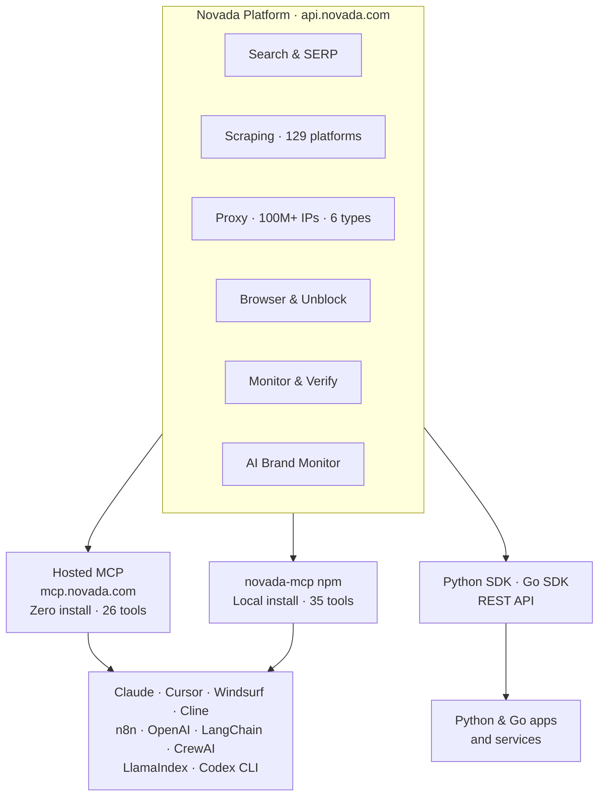

<!-- agent-metadata
name: NovadaLabs
description: Web data and proxy infrastructure platform for customers and AI agents
primary-package: novada-mcp
hosted-endpoint: https://mcp.novada.com/YOUR_KEY/mcp
install: npx -y novada-mcp
env-required: NOVADA_API_KEY
tools: novada_search, novada_research, novada_verify, novada_ai_monitor, novada_monitor, novada_discover, novada_extract, novada_scrape, novada_unblock, novada_crawl, novada_map, novada_scraper_submit, novada_scraper_status, novada_scraper_result, novada_browser, novada_browser_flow, novada_proxy, novada_proxy_residential, novada_proxy_isp, novada_proxy_datacenter, novada_proxy_mobile, novada_proxy_static, novada_proxy_dedicated, novada_wallet_balance, novada_account_summary, novada_health
integrations: Claude Desktop, Claude Code, Cursor, OpenAI Agents SDK, LangChain, LlamaIndex, CrewAI, n8n, Windsurf, Cline, Codex CLI
categories: web-data-platform, proxy-network, mcp-server, web-scraping, search, browser-automation
-->

<div align="center">
  <picture>
    <source media="(prefers-color-scheme: dark)" srcset="https://raw.githubusercontent.com/NovadaLabs/.github/main/profile/logo-dark.png">
    
  </picture>

  <h3>Web data & proxy infrastructure for customers and AI agents</h3>
  <p>Search, scrape, crawl, proxy, monitor, and browse — one platform, one API key.<br>
  Powered by our own network across 195 countries. Built for scale.</p>

  <a href="https://www.novada.com"></a>
  <a href="https://developer.novada.com"></a>
  <a href="https://dashboard.novada.com"></a>

  <br><br>

  
  
  
  

  <br><br>

  <a href="https://www.npmjs.com/package/novada-mcp"></a>
  <a href="https://www.npmjs.com/package/novada-mcp"></a>
  <a href="https://github.com/NovadaLabs/novada-mcp/blob/main/LICENSE"></a>
  <a href="https://x.com/Novada_Proxy"></a>
</div>

<br>

## What Novada offers

<table>
<tr>
<td align="center" width="33%">
<br><br>
<b>Search & SERP</b><br>
<sub>5-engine web search · SERP analytics · deep research · live fact-checking</sub>
</td>
<td align="center" width="33%">
<br><br>
<b>Scraping & Extraction</b><br>
<sub>129 structured platforms · any URL → JSON/markdown · async pipeline</sub>
</td>
<td align="center" width="33%">
<br><br>
<b>Proxy Network</b><br>
<sub>100M+ IPs · 6 types · 195 countries · we own the network</sub>
</td>
</tr>
<tr>
<td align="center" width="33%">
<br><br>
<b>Browser & Unblock</b><br>
<sub>CDP cloud browser · anti-bot bypass · JS rendering · session automation</sub>
</td>
<td align="center" width="33%">
<br><br>
<b>Monitor & Verify</b><br>
<sub>Field-level change detection · claim fact-checking · diff alerts</sub>
</td>
<td align="center" width="33%">
<br><br>
<b>AI Brand Monitor</b><br>
<sub>ChatGPT · Perplexity · Claude · Gemini · Grok — mentions & sentiment</sub>
</td>
</tr>
</table>

<div align="center"><sub>One API key. One output format. One vendor for the whole web-data surface.</sub></div>

<br>

## How it works



<br>

## Quick Start

Get your key at [novada.com](https://www.novada.com) — free tier, 1,000 calls/month, no credit card.

**Option A — Hosted MCP (zero install, 26 tools):**

```json
{
  "mcpServers": {
    "novada": { "url": "https://mcp.novada.com/your_key/mcp" }
  }
}
```

```bash
# Claude Code
claude mcp add --transport http novada https://mcp.novada.com/your_key/mcp
```

**Option B — Local npm (all 35 tools, including browser automation):**

```bash
# Claude Code
claude mcp add novada -e NOVADA_API_KEY=your_key -- npx -y novada-mcp
```

```json
{
  "mcpServers": {
    "novada": {
      "command": "npx",
      "args": ["-y", "novada-mcp"],
      "env": { "NOVADA_API_KEY": "your_key" }
    }
  }
}
```

<details>
<summary><b>All 35 MCP tools</b> — click to expand</summary>

<br>

| Tool | What it does |
| --- | --- |
| **Search & research** | |
| `novada_search` | 5-engine web search with optional inline extraction of top results. |
| `novada_research` | Multi-source cited research — fan-out search → extract → synthesized report. |
| `novada_verify` | Fact-check a claim via 3 parallel search angles. Returns verdict + confidence. |
| `novada_ai_monitor` | How ChatGPT, Perplexity, Grok, Claude, Gemini mention a brand — mentions, sentiment, positioning. |
| `novada_monitor` | Field-level page change detection between calls. |
| `novada_discover` | Find URLs matching a pattern, topic, or site structure. |
| **Extract & scrape** | |
| `novada_extract` | Any URL → clean markdown or structured JSON. Auto anti-bot escalation. |
| `novada_scrape` | 129 structured platforms (Amazon, Reddit, LinkedIn, TikTok…) → structured records. |
| `novada_unblock` | JS rendering + anti-bot bypass for Cloudflare/DataDome/Kasada-protected pages. |
| `novada_scraper_submit` | Submit a batch scrape job asynchronously — returns `task_id`. |
| `novada_scraper_status` | Poll async job status by `task_id`. |
| `novada_scraper_result` | Fetch completed async job result. |
| **Crawl & map** | |
| `novada_crawl` | BFS/DFS walk up to 20 pages — extract content from each. |
| `novada_map` | Return a site's full URL structure without reading content. |
| **Browser** _(local npm only)_ | |
| `novada_browser` | Session-persistent CDP cloud browser — navigate, click, type, screenshot. |
| `novada_browser_flow` | Multi-step browser automation flow. |
| **Proxy** | |
| `novada_proxy` | Universal proxy credential router — pick type, country, session. |
| `novada_proxy_residential` | 100M+ home ISP IPs — geo-sensitive and heavily protected targets. |
| `novada_proxy_isp` | ISP-assigned static IPs — residential trust, datacenter stability. |
| `novada_proxy_datacenter` | Fastest and cheapest — bulk crawls and speed-sensitive jobs. |
| `novada_proxy_mobile` | 4G/5G mobile IPs — mobile-first platforms and apps. |
| `novada_proxy_static` | Static ISP IP — consistent session identity across calls. |
| `novada_proxy_dedicated` | Exclusive datacenter IP — not shared with any other user. |
| **Account & ops** | |
| `novada_wallet_balance` | Master wallet credit balance. |
| `novada_account_summary` | One-shot: wallet + per-product plan balances + recent spend. |
| `novada_traffic_daily` | Daily traffic consumption across proxy products. |
| `novada_health` | Which Novada API products are active on your key. |

Full reference at **[developer.novada.com](https://developer.novada.com)**.

</details>

<br>

## Built for production

- **We own the network.** 100M+ residential IPs across 195 countries — no reseller markup, no third-party SLAs.
- **One key, everything unlocked.** Search, scrape, proxy, monitor, browser, and AI brand tracking — no per-product billing surprises.
- **Sees what others miss.** Field-level change detection, AI model brand monitoring, and claim verification in a single API.
- **Built for agents and developers alike.** Native MCP server for AI agents, Python and Go SDKs for direct integration, REST API for everything else.

## Works with

<div align="center">

| AI Clients | Agent Frameworks | Automation |
| --- | --- | --- |
| Claude Desktop · Claude Code | OpenAI Agents SDK | n8n |
| Cursor · Windsurf · Cline | LangChain | Zapier _(coming soon)_ |
| VS Code | LlamaIndex · CrewAI | |
| Codex CLI | | |

</div>

Full integration guides at **[developer.novada.com](https://developer.novada.com)**.

## Which package?

| If you need… | Use |
| --- | --- |
| Everything — zero install, hosted | `https://mcp.novada.com/your_key/mcp` |
| Everything — local, all 35 tools + browser | `npx novada-mcp` |
| Search, scrape, crawl, research only | `npx novada-search` |
| Proxy credentials only | `npx novada-proxy-mcp` |

Not sure? Start with the hosted endpoint — same key, zero setup.

## Access layers

Novada is a hosted platform — start at **[novada.com](https://www.novada.com)** with one API key. Full docs at **[developer.novada.com](https://developer.novada.com)**.

### Hosted MCP
<a href="https://mcp.novada.com"></a>

**[mcp.novada.com](https://mcp.novada.com)** — remote Streamable-HTTP endpoint, 26 tools
Paste one URL. Always up to date — tools update server-side, no client redeploy needed.

```
https://mcp.novada.com/your_key/mcp
```
<br clear="right"/>

### Unified MCP (npm)
<a href="https://github.com/NovadaLabs/novada-mcp"></a>

**[novada-mcp](https://github.com/NovadaLabs/novada-mcp)** — all 35 tools including browser automation

```bash
npx novada-mcp
```
<br clear="right"/>

### Search & Scraping MCP
<a href="https://github.com/NovadaLabs/novada-search-mcp"></a>

**[novada-search-mcp](https://github.com/NovadaLabs/novada-search-mcp)** — search, extract, crawl, research · npm: `novada-search`
<br clear="right"/>

### Proxy MCP
<a href="https://github.com/NovadaLabs/novada-proxy"></a>

**[novada-proxy](https://github.com/NovadaLabs/novada-proxy)** — 6 proxy types for AI agents · npm: `novada-proxy-mcp`
<br clear="right"/>

## SDKs & official libraries

- **[novada-python](https://github.com/NovadaLabs/novada-python)** — official Python client for the Novada API.
- **[novada-go](https://github.com/NovadaLabs/novada-go)** — official Go client for the Novada API.

## Integrations & extensions

- **[novada-proxy-extension](https://github.com/NovadaLabs/novada-proxy-extension)** — route browser traffic through Novada's proxy network (Chrome, Manifest V3).
- **[novada-scraper-skill](https://github.com/NovadaLabs/novada-scraper-skill)** — agent skill: turn any website into structured data.
- **[novada-webunblocker-skill](https://github.com/NovadaLabs/novada-webunblocker-skill)** — agent skill: reach sites that fight back.

_Coming soon: deeper LangChain · CrewAI · n8n · Zapier integrations._

**Building with Novada?** We're happy to integrate with any agent framework, MCP client, or automation platform. [Open an issue](https://github.com/NovadaLabs/novada-mcp/issues) or reach us at [novada.com](https://www.novada.com).

## Connect

<div align="center">
  <a href="https://developer.novada.com"></a>
  <a href="https://discord.gg/DgmrpTs86c"></a>
  <a href="https://x.com/Novada_Proxy"></a>
  <a href="https://www.linkedin.com/company/novadalabs"></a>
</div>

<div align="center">
  <br>
  <strong>Web data & proxy infrastructure — for the people building with it, and the agents they build.</strong><br><br>
  <a href="https://mcp.novada.com">Hosted MCP</a> ·
  <a href="https://github.com/NovadaLabs/novada-mcp">Star the flagship</a> ·
  <a href="https://www.novada.com">Get an API key</a> ·
  <a href="https://developer.novada.com">Read the docs</a>
</div>
